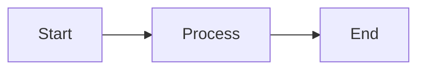

# FormatAI ✨

[](https://opensource.org/licenses/MIT)
[](https://www.typescriptlang.org/)
[](https://react.dev/)
[](https://vitejs.dev/)
[](https://www.docker.com/)

**FormatAI** is an intelligent content formatting tool that transforms raw text, markdown, and various content formats into beautifully structured HTML. Perfect for content creators, developers, educators, and anyone who needs professional formatting with AI-powered enhancement.

## 🌟 Features

### 📝 Content Transformation
- **Smart Formatting**: Convert plain text and markdown into professionally styled HTML
- **LaTeX Support**: Render mathematical equations with KaTeX (inline `$...$` and block `$$...$$`)
- **Mermaid Diagrams**: Create professional diagrams (flowcharts, sequence diagrams, Gantt charts, and more)
- **File Upload**: Support for `.txt` and `.md` files with easy drag-and-drop

### 🤖 Multi-Provider AI Support
- **Google Gemini**: Advanced AI-powered content formatting with gemini-2.5-flash
- **OpenRouter**: Access to multiple AI models (GPT-4, Claude, Llama, and more)
- **Flexible Model Selection**: Choose specific models or use intelligent defaults
- **Secure API Management**: Local storage for API keys with environment variable fallback

### 🎨 Professional Design
- **Dark Theme**: Modern, eye-friendly dark theme design
- **Responsive Layout**: Flawless experience on desktop and mobile devices
- **Live Preview**: Real-time rendering with instant feedback
- **Export Options**: Copy HTML or open in new tab for seamless sharing

### 🐳 Docker Support
- **Production-Ready**: Optimized Docker container with Nginx
- **Easy Deployment**: One-command setup with Docker Compose
- **Environment Variables**: Secure API key management for production
- **Health Checks**: Built-in health monitoring and auto-restart

## 🚀 Quick Start

### Option 1: Docker (Recommended)

#### Prerequisites
- Docker and Docker Compose
- API keys for your preferred AI provider(s)

#### Setup
1. **Clone the repository**
   ```bash
   git clone https://github.com/LookUpMark/format-ai.git
   cd format-ai
   ```

2. **Set up API keys**
   ```bash
   cp .env.example .env
   # Edit .env and add your actual API keys
   ```

3. **Start with Docker**
   ```bash
   docker compose up --build
   ```

4. **Open your browser**
   Navigate to [http://localhost:5175](http://localhost:5175)

### Option 2: Local Development

#### Prerequisites
- Node.js 18+
- NPM or Yarn
- API keys for your preferred AI provider(s)

#### Setup
1. **Clone the repository**
   ```bash
   git clone https://github.com/LookUpMark/format-ai.git
   cd format-ai
   ```

2. **Install dependencies**
   ```bash
   npm install
   ```

3. **Set up API keys**
   **Option A: Environment Variables (Recommended for Docker)**
   ```bash
   cp .env.example .env
   # Edit .env and add your actual API keys:
   # GEMINI_API_KEY=your_actual_gemini_api_key
   # OPENROUTER_API_KEY=your_actual_openrouter_api_key
   ```

   **Option B: UI Input (Great for development and local storage)**
   - Start the development server
   - Click the "Show API Keys" section in the UI  
   - Enter your API keys directly in the interface (automatically saved to browser)

4. **Start the development server**
   ```bash
   npm run dev
   ```

5. **Open your browser**
   Navigate to [http://localhost:5175](http://localhost:5175)

## 🐳 Docker Deployment

### Production Deployment
```bash
# Build and run with Docker Compose
docker compose up --build

# Run in background
docker compose up -d --build

# Stop the application
docker compose down
```

### Manual Docker Build
```bash
# Build the image
docker build -t format-ai .

# Run the container
docker run -p 5175:5175 format-ai
```

### Environment Variables
For production Docker deployments, make sure to set your API keys in the `.env` file:

```bash
# .env file
GEMINI_API_KEY=your_actual_gemini_api_key_here
OPENROUTER_API_KEY=your_actual_openrouter_api_key_here
```

## 🔑 Getting API Keys

### Google Gemini
1. Go to [Google AI Studio](https://makersuite.google.com/app/apikey)
2. Sign in with your Google account
3. Click "Create API Key"
4. Copy your API key

### OpenRouter
1. Go to [OpenRouter](https://openrouter.ai/keys)
2. Sign up or log in
3. Add funds to your account (free tier available)
4. Create an API key
5. Copy your API key

## 📖 Usage Guide

### Basic Workflow
1. **Input Content**: Type or paste your text, markdown, LaTeX equations, or Mermaid diagrams
2. **Choose AI Provider**: Select between Google Gemini or OpenRouter
3. **Select Model**: Use the default model or specify a custom one
4. **Generate**: Click "Format Content" and let AI transform your input
5. **Export**: Copy the formatted HTML or open in a new tab

### Advanced Features

#### Model Selection
- **Google Gemini**: `gemini-2.5-flash` (default), `gemini-pro`, etc.
- **OpenRouter**: `anthropic/claude-3.5-sonnet`, `openai/gpt-4`, `meta/llama-3.1-8b`, etc.

#### Supported Content Types

**LaTeX Equations**
```latex
Inline: $E = mc^2$
Block: $$\int_0^\infty e^{-x^2} dx = \frac{\sqrt{\pi}}{2}$$
```

**Mermaid Diagrams**


**Markdown**
```markdown
# Heading
- List item
**Bold text**
*Italic text*
```

## 🛠️ Development

### Project Structure
```
format-ai/
├── components/
│   └── Preview.tsx          # HTML preview component
├── services/
│   ├── aiService.ts        # Multi-provider AI service
│   └── geminiService.ts    # Gemini-specific service
├── App.tsx                 # Main application component
├── index.tsx               # React entry point
├── index.html              # HTML template
├── vite.config.ts          # Vite configuration
├── package.json            # Dependencies and scripts
├── Dockerfile              # Docker container definition
├── docker-compose.yml      # Docker Compose configuration
├── nginx.conf              # Nginx configuration for production
├── .env.example            # Environment variables template
└── README.md               # This file
```

### Available Scripts
```bash
npm run dev        # Start development server (port 5175)
npm run build      # Build for production
npm run preview    # Preview production build
```

### Docker Commands
```bash
docker compose up --build          # Build and start
docker compose up -d --build       # Build and start in background
docker compose down                 # Stop and remove containers
docker compose logs -f              # Follow logs
docker compose restart              # Restart services
```

### Building for Production
```bash
# Local build
npm run build

# Docker build
docker compose up --build
```

Built files will be in the `dist/` directory or served by the Docker container.

### API Key Management

The application supports three methods for API key configuration:

1. **Browser Local Storage**: Enter keys in the UI (persists across sessions)
2. **Environment Variables**: Set in `.env` file for development
3. **Docker Build Args**: Embedded during container build for production

Priority: Local Storage → Environment Variables → Build Args

## 🔧 Configuration

### Environment Variables
- `GEMINI_API_KEY`: Your Google Gemini API key
- `OPENROUTER_API_KEY`: Your OpenRouter API key  
- `NODE_ENV`: Environment mode (automatically set)

### Ports
- **Development**: `http://localhost:5175`
- **Docker**: `http://localhost:5175`  
- Both development and production use the same port for consistency

### Docker Configuration
- **Base Images**: Node.js 18 Alpine + Nginx Alpine
- **Multi-stage Build**: Optimized for production
- **Security**: Non-root user, minimal privileges
- **Health Checks**: Automatic container health monitoring

## 🎯 Use Cases

### For Content Creators
- Transform blog drafts into polished HTML
- Create consistent content formatting
- Generate social media-ready content

### For Developers
- Format technical documentation
- Create README files and API docs
- Generate consistent code documentation

### For Educators
- Prepare professional course materials
- Create interactive presentations
- Generate educational content

### For Students
- Transform lecture notes into study materials
- Create mathematical cheat sheets
- Visualize complex concepts

## � Troubleshooting

### Common Issues

**API Key Errors**
- Ensure API keys are properly set in `.env` or entered in the UI
- Verify API keys are active and have sufficient credits
- Check browser console for detailed error messages

**Docker Issues**
- Make sure Docker and Docker Compose are installed
- Check that port 5175 is not in use by another application
- Review logs with `docker compose logs -f`

**Build Failures**  
- Clear node_modules and reinstall: `rm -rf node_modules && npm install`
- For Docker: `docker compose down && docker compose up --build --force-recreate`

**Port Conflicts**
- Both development and Docker use port 5175 for consistency
- If needed, modify the port in `vite.config.ts` and `docker-compose.yml`

### Getting Help
- Check the [Issues](https://github.com/LookUpMark/format-ai/issues) page
- Review [Docker documentation](DOCKER.md) for detailed setup instructions
- Ensure your API keys are correctly configured

## �📄 License

This project is licensed under the MIT License - see the [LICENSE](LICENSE) file for details.

## 🙏 Acknowledgments

- **Google AI**: For the powerful Gemini API
- **OpenRouter**: For providing access to multiple AI models
- **React Team**: For the excellent React framework
- **Vite**: For the lightning-fast build tool
- **KaTeX**: For beautiful LaTeX rendering
- **Mermaid**: For diagram generation

