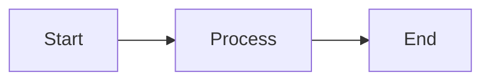

# FormatAI ✨

[](https://opensource.org/licenses/MIT)
[](https://www.typescriptlang.org/)
[](https://react.dev/)
[](https://vitejs.dev/)

**FormatAI** is an intelligent content formatting tool that transforms raw text, markdown, and various content formats into beautifully structured HTML. Perfect for content creators, developers, educators, and anyone who needs professional formatting with AI-powered enhancement.

## 🌟 Features

### 📝 Content Transformation
- **Smart Formatting**: Convert plain text and markdown into professionally styled HTML
- **LaTeX Support**: Render mathematical equations with KaTeX (inline `$...$` and block `$$...$$`)
- **Mermaid Diagrams**: Create professional diagrams (flowcharts, sequence diagrams, Gantt charts, and more)
- **File Upload**: Support for `.txt` and `.md` files with easy drag-and-drop

### 🤖 Multi-Provider AI Support
- **Google Gemini**: Advanced AI-powered content formatting with gemini-2.5-flash
- **OpenRouter**: Access to multiple AI models (GPT-4, Claude, Llama, and more)
- **Flexible Model Selection**: Choose specific models or use intelligent defaults
- **Secure API Management**: Local storage for API keys with environment variable support

### 🎨 Professional Design
- **Dark Theme**: Modern, eye-friendly dark theme design
- **Responsive Layout**: Flawless experience on desktop and mobile devices
- **Live Preview**: Real-time rendering with instant feedback
- **Export Options**: Copy HTML or open in new tab for seamless sharing

## 🚀 Quick Start

### Prerequisites
- Node.js 18+
- NPM or Yarn
- API keys for your preferred AI provider(s)

### Installation

1. **Clone the repository**
   ```bash
   git clone https://github.com/your-username/format-ai.git
   cd format-ai
   ```

2. **Install dependencies**
   ```bash
   npm install
   ```

3. **Set up API keys**

   **Option A: Environment Variables (Recommended for production)**
   ```bash
   # For Google Gemini
   echo "GEMINI_API_KEY=your_gemini_api_key" >> .env.local

   # For OpenRouter
   echo "OPENROUTER_API_KEY=your_openrouter_api_key" >> .env.local
   ```

   **Option B: UI Input (Great for development and testing)**
   - Start the development server
   - Click the "API Keys" section in the UI
   - Enter your API keys directly in the interface

4. **Start the development server**
   ```bash
   npm run dev
   ```

5. **Open your browser**
   Navigate to [http://localhost:3000](http://localhost:3000)

## 🔑 Getting API Keys

### Google Gemini
1. Go to [Google AI Studio](https://makersuite.google.com/app/apikey)
2. Sign in with your Google account
3. Click "Create API Key"
4. Copy your API key

### OpenRouter
1. Go to [OpenRouter](https://openrouter.ai/keys)
2. Sign up or log in
3. Add funds to your account (free tier available)
4. Create an API key
5. Copy your API key

## 📖 Usage Guide

### Basic Workflow
1. **Input Content**: Type or paste your text, markdown, LaTeX equations, or Mermaid diagrams
2. **Choose AI Provider**: Select between Google Gemini or OpenRouter
3. **Select Model**: Use the default model or specify a custom one
4. **Generate**: Click "Format Content" and let AI transform your input
5. **Export**: Copy the formatted HTML or open in a new tab

### Advanced Features

#### Model Selection
- **Google Gemini**: `gemini-2.5-flash` (default), `gemini-pro`, etc.
- **OpenRouter**: `anthropic/claude-3.5-sonnet`, `openai/gpt-4`, `meta/llama-3.1-8b`, etc.

#### Supported Content Types

**LaTeX Equations**
```latex
Inline: $E = mc^2$
Block: $$\int_0^\infty e^{-x^2} dx = \frac{\sqrt{\pi}}{2}$$
```

**Mermaid Diagrams**


**Markdown**
```markdown
# Heading
- List item
**Bold text**
*Italic text*
```

## 🛠️ Development

### Project Structure
```
format-ai/
├── components/
│   └── Preview.tsx          # HTML preview component
├── services/
│   ├── aiService.ts        # Multi-provider AI service
│   └── geminiService.ts    # Legacy Gemini service
├── App.tsx                 # Main application component
├── index.tsx               # React entry point
├── index.html              # HTML template
├── vite.config.ts          # Vite configuration
├── package.json            # Dependencies and scripts
└── metadata.json           # AI Studio metadata
```

### Available Scripts
```bash
npm run dev        # Start development server
npm run build      # Build for production
npm run preview    # Preview production build
```

### Building for Production
```bash
npm run build
```
Built files will be in the `dist/` directory.

## 🎯 Use Cases

### For Content Creators
- Transform blog drafts into polished HTML
- Create consistent content formatting
- Generate social media-ready content

### For Developers
- Format technical documentation
- Create README files and API docs
- Generate consistent code documentation

### For Educators
- Prepare professional course materials
- Create interactive presentations
- Generate educational content

### For Students
- Transform lecture notes into study materials
- Create mathematical cheat sheets
- Visualize complex concepts

## 📄 License

This project is licensed under the MIT License - see the [LICENSE](LICENSE) file for details.

